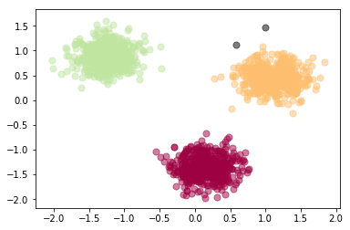
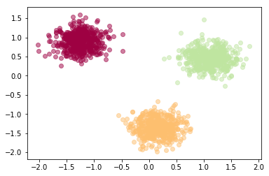

<a href="https://www.bigdatauniversity.com"></a>

<h1><center>Density-Based Clustering</center></h1>

Most of the traditional clustering techniques, such as k-means, hierarchical and fuzzy clustering, can be used to group data without supervision. 

However, when applied to tasks with arbitrary shape clusters, or clusters within cluster, the traditional techniques might be unable to achieve good results. That is, elements in the same cluster might not share enough similarity or the performance may be poor.
Additionally, Density-based Clustering locates regions of high density that are separated from one another by regions of low density. Density, in this context, is defined as the number of points within a specified radius.


In this section, the main focus will be manipulating the data and properties of DBSCAN and observing the resulting clustering.

<h1>Table of contents</h1>

<div class="alert alert-block alert-info" style="margin-top: 20px">
    <ol>
        <li>Clustering with Randomly Generated Data</li>
            <ol>
                <li><a href="#data_generation">Data generation</a></li>
                <li><a href="#modeling">Modeling</a></li>
                <li><a href="#distinguishing_outliers">Distinguishing Outliers</a></li>
                <li><a href="#data_visualization">Data Visualization</a></li>
            </ol>
        <li><a href="#weather_station_clustering">Weather Station Clustering with DBSCAN & scikit-learn</a></li>   
            <ol>
                <li><a href="#download_data">Loading data</a></li>
                <li><a href="#load_dataset">Overview data</a></li>
                <li><a href="#cleaning">Data cleaning</a></li>
                <li><a href="#visualization">Data selection</a></li>
                <li><a href="#clustering">Clustering</a></li>
                <li><a href="#visualize_cluster">Visualization of clusters based on location</a></li>
                <li><a href="#clustering_location_mean_max_min_temperature">Clustering of stations based on their location, mean, max, and min Temperature</a></li>
                <li><a href="#visualization_location_temperature">Visualization of clusters based on location and Temperature</a></li>
            </ol>
    </ol>
</div>

Import the following libraries:
<ul>
    <li> <b>numpy as np</b> </li>
    <li> <b>DBSCAN</b> from <b>sklearn.cluster</b> </li>
    <li> <b>make_blobs</b> from <b>sklearn.datasets.samples_generator</b> </li>
    <li> <b>StandardScaler</b> from <b>sklearn.preprocessing</b> </li>
    <li> <b>matplotlib.pyplot as plt</b> </li>
</ul> <br>
Remember <b> %matplotlib inline </b> to display plots


```python
# Notice: For visualization of map, you need basemap package.
# if you dont have basemap install on your machine, you can use the following line to install it
# !conda install -c conda-forge  basemap==1.1.0  matplotlib==2.2.2  -y
# Notice: you maight have to refresh your page and re-run the notebook after installation
```


```python
import numpy as np 
from sklearn.cluster import DBSCAN 
from sklearn.datasets.samples_generator import make_blobs 
from sklearn.preprocessing import StandardScaler 
import matplotlib.pyplot as plt 
%matplotlib inline
```

<h2 id="data_generation">Data generation</h2>
The function below will generate the data points and requires these inputs:
<ul>
    <li> <b>centroidLocation</b>: Coordinates of the centroids that will generate the random data. </li>
    <ul> <li> Example: input: [[4,3], [2,-1], [-1,4]] </li> </ul>
    <li> <b>numSamples</b>: The number of data points we want generated, split over the number of centroids (# of centroids defined in centroidLocation) </li>
    <ul> <li> Example: 1500 </li> </ul>
    <li> <b>clusterDeviation</b>: The standard deviation between the clusters. The larger the number, the further the spacing. </li>
    <ul> <li> Example: 0.5 </li> </ul>
</ul>


```python
def createDataPoints(centroidLocation, numSamples, clusterDeviation):
    # Create random data and store in feature matrix X and response vector y.
    X, y = make_blobs(n_samples=numSamples, centers=centroidLocation, 
                                cluster_std=clusterDeviation)
    
    # Standardize features by removing the mean and scaling to unit variance
    X = StandardScaler().fit_transform(X)
    return X, y
```

Use <b>createDataPoints</b> with the <b>3 inputs</b> and store the output into variables <b>X</b> and <b>y</b>.


```python
X, y = createDataPoints([[4,3], [2,-1], [-1,4]] , 1500, 0.5)
```

<h2 id="modeling">Modeling</h2>
DBSCAN stands for Density-Based Spatial Clustering of Applications with Noise. This technique is one of the most common clustering algorithms  which works based on density of object.
The whole idea is that if a particular point belongs to a cluster, it should be near to lots of other points in that cluster.

It works based on two parameters: Epsilon and Minimum Points  
__Epsilon__ determine a specified radius that if includes enough number of points within, we call it dense area  
__minimumSamples__ determine the minimum number of data points we want in a neighborhood to define a cluster.


```python
epsilon = 0.3
minimumSamples = 7
db = DBSCAN(eps=epsilon, min_samples=minimumSamples).fit(X)
labels = db.labels_
labels
```


    array([0, 0, 0, ..., 1, 1, 0])


<h2 id="distinguishing_outliers">Distinguishing Outliers</h2>
Lets Replace all elements with 'True' in core_samples_mask that are in the cluster, 'False' if the points are outliers.


```python
# First, create an array of booleans using the labels from db.
core_samples_mask = np.zeros_like(db.labels_, dtype=bool)
core_samples_mask[db.core_sample_indices_] = True
core_samples_mask
```


    array([ True,  True,  True, ...,  True,  True,  True])


```python
# Number of clusters in labels, ignoring noise if present.
n_clusters_ = len(set(labels)) - (1 if -1 in labels else 0)
n_clusters_
```


    3


```python
# Remove repetition in labels by turning it into a set.
unique_labels = set(labels)
unique_labels
```


    {-1, 0, 1, 2}


<h2 id="data_visualization">Data visualization</h2>


```python
# Create colors for the clusters.
colors = plt.cm.Spectral(np.linspace(0, 1, len(unique_labels)))
colors
```


    array([[0.61960784, 0.00392157, 0.25882353, 1.        ],
           [0.99346405, 0.74771242, 0.43529412, 1.        ],
           [0.74771242, 0.89803922, 0.62745098, 1.        ],
           [0.36862745, 0.30980392, 0.63529412, 1.        ]])


```python
# Plot the points with colors
for k, col in zip(unique_labels, colors):
    if k == -1:
        # Black used for noise.
        col = 'k'

    class_member_mask = (labels == k)

    # Plot the datapoints that are clustered
    xy = X[class_member_mask & core_samples_mask]
    plt.scatter(xy[:, 0], xy[:, 1],s=50, c=col, marker=u'o', alpha=0.5)

    # Plot the outliers
    xy = X[class_member_mask & ~core_samples_mask]
    plt.scatter(xy[:, 0], xy[:, 1],s=50, c=col, marker=u'o', alpha=0.5)
```





## Practice
To better underestand differences between partitional and density-based clusteitng, try to cluster the above dataset into 3 clusters using k-Means.  
Notice: do not generate data again, use the same dataset as above.


```python
# write your code here
from sklearn.cluster import KMeans 
k = 3
k_means3 = KMeans(init = "k-means++", n_clusters = k, n_init = 12)
k_means3.fit(X)
fig = plt.figure(figsize=(6, 4))
ax = fig.add_subplot(1, 1, 1)
for k, col in zip(range(k), colors):
    my_members = (k_means3.labels_ == k)
    plt.scatter(X[my_members, 0], X[my_members, 1],  c=col, marker=u'o', alpha=0.5)
plt.show()

```





Double-click __here__ for the solution.

<!-- Your answer is below:


from sklearn.cluster import KMeans 
k = 3
k_means3 = KMeans(init = "k-means++", n_clusters = k, n_init = 12)
k_means3.fit(X)
fig = plt.figure(figsize=(6, 4))
ax = fig.add_subplot(1, 1, 1)
for k, col in zip(range(k), colors):
    my_members = (k_means3.labels_ == k)
    plt.scatter(X[my_members, 0], X[my_members, 1],  c=col, marker=u'o', alpha=0.5)
plt.show()


-->


<h1 id="weather_station_clustering" align="center"> Weather Station Clustering using DBSCAN & scikit-learn </h1>
<hr>

DBSCAN is specially very good for tasks like class identification on a spatial context. The wonderful attribute of DBSCAN algorithm is that it can find out any arbitrary shape cluster without getting affected by noise. For example, this following example cluster the location of weather stations in Canada.
<br>
DBSCAN can be used here, for instance, to find the group of stations which show the same weather condition. As you can see, it not only finds different arbitrary shaped clusters, can find the denser part of data-centered samples by ignoring less-dense areas or noises.

let's start playing with the data. We will be working according to the following workflow: </font>


### About the dataset

		
<h4 align = "center">
Environment Canada    
Monthly Values for July - 2015	
</h4>
<html>
<head>
<style>
table {
    font-family: arial, sans-serif;
    border-collapse: collapse;
    width: 100%;
}

td, th {
    border: 1px solid #dddddd;
    text-align: left;
    padding: 8px;
}

tr:nth-child(even) {
    background-color: #dddddd;
}
</style>
</head>
<body>

<table>
  <tr>
    <th>Name in the table</th>
    <th>Meaning</th>
  </tr>
  <tr>
    <td><font color = "green"><strong>Stn_Name</font></td>
    <td><font color = "green"><strong>Station Name</font</td>
  </tr>
  <tr>
    <td><font color = "green"><strong>Lat</font></td>
    <td><font color = "green"><strong>Latitude (North+, degrees)</font></td>
  </tr>
  <tr>
    <td><font color = "green"><strong>Long</font></td>
    <td><font color = "green"><strong>Longitude (West - , degrees)</font></td>
  </tr>
  <tr>
    <td>Prov</td>
    <td>Province</td>
  </tr>
  <tr>
    <td>Tm</td>
    <td>Mean Temperature (°C)</td>
  </tr>
  <tr>
    <td>DwTm</td>
    <td>Days without Valid Mean Temperature</td>
  </tr>
  <tr>
    <td>D</td>
    <td>Mean Temperature difference from Normal (1981-2010) (°C)</td>
  </tr>
  <tr>
    <td><font color = "black">Tx</font></td>
    <td><font color = "black">Highest Monthly Maximum Temperature (°C)</font></td>
  </tr>
  <tr>
    <td>DwTx</td>
    <td>Days without Valid Maximum Temperature</td>
  </tr>
  <tr>
    <td><font color = "black">Tn</font></td>
    <td><font color = "black">Lowest Monthly Minimum Temperature (°C)</font></td>
  </tr>
  <tr>
    <td>DwTn</td>
    <td>Days without Valid Minimum Temperature</td>
  </tr>
  <tr>
    <td>S</td>
    <td>Snowfall (cm)</td>
  </tr>
  <tr>
    <td>DwS</td>
    <td>Days without Valid Snowfall</td>
  </tr>
  <tr>
    <td>S%N</td>
    <td>Percent of Normal (1981-2010) Snowfall</td>
  </tr>
  <tr>
    <td><font color = "green"><strong>P</font></td>
    <td><font color = "green"><strong>Total Precipitation (mm)</font></td>
  </tr>
  <tr>
    <td>DwP</td>
    <td>Days without Valid Precipitation</td>
  </tr>
  <tr>
    <td>P%N</td>
    <td>Percent of Normal (1981-2010) Precipitation</td>
  </tr>
  <tr>
    <td>S_G</td>
    <td>Snow on the ground at the end of the month (cm)</td>
  </tr>
  <tr>
    <td>Pd</td>
    <td>Number of days with Precipitation 1.0 mm or more</td>
  </tr>
  <tr>
    <td>BS</td>
    <td>Bright Sunshine (hours)</td>
  </tr>
  <tr>
    <td>DwBS</td>
    <td>Days without Valid Bright Sunshine</td>
  </tr>
  <tr>
    <td>BS%</td>
    <td>Percent of Normal (1981-2010) Bright Sunshine</td>
  </tr>
  <tr>
    <td>HDD</td>
    <td>Degree Days below 18 °C</td>
  </tr>
  <tr>
    <td>CDD</td>
    <td>Degree Days above 18 °C</td>
  </tr>
  <tr>
    <td>Stn_No</td>
    <td>Climate station identifier (first 3 digits indicate   drainage basin, last 4 characters are for sorting alphabetically).</td>
  </tr>
  <tr>
    <td>NA</td>
    <td>Not Available</td>
  </tr>


</table>

</body>
</html>

 

### 1-Download data
<div id="download_data">
    To download the data, we will use <b>!wget</b> to download it from IBM Object Storage.<br> 
    <b>Did you know?</b> When it comes to Machine Learning, you will likely be working with large datasets. As a business, where can you host your data? IBM is offering a unique opportunity for businesses, with 10 Tb of IBM Cloud Object Storage: <a href="http://cocl.us/ML0101EN-IBM-Offer-CC">Sign up now for free</a>
</div>


```python
!wget -O weather-stations20140101-20141231.csv https://s3-api.us-geo.objectstorage.softlayer.net/cf-courses-data/CognitiveClass/ML0101ENv3/labs/weather-stations20140101-20141231.csv
```

    --2018-12-29 13:14:12--  https://s3-api.us-geo.objectstorage.softlayer.net/cf-courses-data/CognitiveClass/ML0101ENv3/labs/weather-stations20140101-20141231.csv
    Resolving s3-api.us-geo.objectstorage.softlayer.net (s3-api.us-geo.objectstorage.softlayer.net)... 67.228.254.193
    Connecting to s3-api.us-geo.objectstorage.softlayer.net (s3-api.us-geo.objectstorage.softlayer.net)|67.228.254.193|:443... connected.
    HTTP request sent, awaiting response... 200 OK
    Length: 129821 (127K) [text/csv]
    Saving to: ‘weather-stations20140101-20141231.csv’
    
    weather-stations201 100%[=====================>] 126.78K  --.-KB/s   in 0.06s  
    
    2018-12-29 13:14:13 (1.95 MB/s) - ‘weather-stations20140101-20141231.csv’ saved [129821/129821]
    


### 2- Load the dataset
<div id="load_dataset">
We will import the .csv then we creates the columns for year, month and day.
</div>


```python
import csv
import pandas as pd
import numpy as np

filename='weather-stations20140101-20141231.csv'

#Read csv
pdf = pd.read_csv(filename)
pdf.head(5)
```


<div>
<style scoped>
    .dataframe tbody tr th:only-of-type {
        vertical-align: middle;
    }

    .dataframe tbody tr th {
        vertical-align: top;
    }

    .dataframe thead th {
        text-align: right;
    }
</style>
<table border="1" class="dataframe">
  <thead>
    <tr style="text-align: right;">
      <th></th>
      <th>Stn_Name</th>
      <th>Lat</th>
      <th>Long</th>
      <th>Prov</th>
      <th>Tm</th>
      <th>DwTm</th>
      <th>D</th>
      <th>Tx</th>
      <th>DwTx</th>
      <th>Tn</th>
      <th>...</th>
      <th>DwP</th>
      <th>P%N</th>
      <th>S_G</th>
      <th>Pd</th>
      <th>BS</th>
      <th>DwBS</th>
      <th>BS%</th>
      <th>HDD</th>
      <th>CDD</th>
      <th>Stn_No</th>
    </tr>
  </thead>
  <tbody>
    <tr>
      <th>0</th>
      <td>CHEMAINUS</td>
      <td>48.935</td>
      <td>-123.742</td>
      <td>BC</td>
      <td>8.2</td>
      <td>0.0</td>
      <td>NaN</td>
      <td>13.5</td>
      <td>0.0</td>
      <td>1.0</td>
      <td>...</td>
      <td>0.0</td>
      <td>NaN</td>
      <td>0.0</td>
      <td>12.0</td>
      <td>NaN</td>
      <td>NaN</td>
      <td>NaN</td>
      <td>273.3</td>
      <td>0.0</td>
      <td>1011500</td>
    </tr>
    <tr>
      <th>1</th>
      <td>COWICHAN LAKE FORESTRY</td>
      <td>48.824</td>
      <td>-124.133</td>
      <td>BC</td>
      <td>7.0</td>
      <td>0.0</td>
      <td>3.0</td>
      <td>15.0</td>
      <td>0.0</td>
      <td>-3.0</td>
      <td>...</td>
      <td>0.0</td>
      <td>104.0</td>
      <td>0.0</td>
      <td>12.0</td>
      <td>NaN</td>
      <td>NaN</td>
      <td>NaN</td>
      <td>307.0</td>
      <td>0.0</td>
      <td>1012040</td>
    </tr>
    <tr>
      <th>2</th>
      <td>LAKE COWICHAN</td>
      <td>48.829</td>
      <td>-124.052</td>
      <td>BC</td>
      <td>6.8</td>
      <td>13.0</td>
      <td>2.8</td>
      <td>16.0</td>
      <td>9.0</td>
      <td>-2.5</td>
      <td>...</td>
      <td>9.0</td>
      <td>NaN</td>
      <td>NaN</td>
      <td>11.0</td>
      <td>NaN</td>
      <td>NaN</td>
      <td>NaN</td>
      <td>168.1</td>
      <td>0.0</td>
      <td>1012055</td>
    </tr>
    <tr>
      <th>3</th>
      <td>DISCOVERY ISLAND</td>
      <td>48.425</td>
      <td>-123.226</td>
      <td>BC</td>
      <td>NaN</td>
      <td>NaN</td>
      <td>NaN</td>
      <td>12.5</td>
      <td>0.0</td>
      <td>NaN</td>
      <td>...</td>
      <td>NaN</td>
      <td>NaN</td>
      <td>NaN</td>
      <td>NaN</td>
      <td>NaN</td>
      <td>NaN</td>
      <td>NaN</td>
      <td>NaN</td>
      <td>NaN</td>
      <td>1012475</td>
    </tr>
    <tr>
      <th>4</th>
      <td>DUNCAN KELVIN CREEK</td>
      <td>48.735</td>
      <td>-123.728</td>
      <td>BC</td>
      <td>7.7</td>
      <td>2.0</td>
      <td>3.4</td>
      <td>14.5</td>
      <td>2.0</td>
      <td>-1.0</td>
      <td>...</td>
      <td>2.0</td>
      <td>NaN</td>
      <td>NaN</td>
      <td>11.0</td>
      <td>NaN</td>
      <td>NaN</td>
      <td>NaN</td>
      <td>267.7</td>
      <td>0.0</td>
      <td>1012573</td>
    </tr>
  </tbody>
</table>
<p>5 rows × 25 columns</p>
</div>


### 3-Cleaning
<div id="cleaning">
Lets remove rows that don't have any value in the <b>Tm</b> field.
</div>


```python
pdf = pdf[pd.notnull(pdf["Tm"])]
pdf = pdf.reset_index(drop=True)
pdf.head(5)
```


<div>
<style scoped>
    .dataframe tbody tr th:only-of-type {
        vertical-align: middle;
    }

    .dataframe tbody tr th {
        vertical-align: top;
    }

    .dataframe thead th {
        text-align: right;
    }
</style>
<table border="1" class="dataframe">
  <thead>
    <tr style="text-align: right;">
      <th></th>
      <th>Stn_Name</th>
      <th>Lat</th>
      <th>Long</th>
      <th>Prov</th>
      <th>Tm</th>
      <th>DwTm</th>
      <th>D</th>
      <th>Tx</th>
      <th>DwTx</th>
      <th>Tn</th>
      <th>...</th>
      <th>DwP</th>
      <th>P%N</th>
      <th>S_G</th>
      <th>Pd</th>
      <th>BS</th>
      <th>DwBS</th>
      <th>BS%</th>
      <th>HDD</th>
      <th>CDD</th>
      <th>Stn_No</th>
    </tr>
  </thead>
  <tbody>
    <tr>
      <th>0</th>
      <td>CHEMAINUS</td>
      <td>48.935</td>
      <td>-123.742</td>
      <td>BC</td>
      <td>8.2</td>
      <td>0.0</td>
      <td>NaN</td>
      <td>13.5</td>
      <td>0.0</td>
      <td>1.0</td>
      <td>...</td>
      <td>0.0</td>
      <td>NaN</td>
      <td>0.0</td>
      <td>12.0</td>
      <td>NaN</td>
      <td>NaN</td>
      <td>NaN</td>
      <td>273.3</td>
      <td>0.0</td>
      <td>1011500</td>
    </tr>
    <tr>
      <th>1</th>
      <td>COWICHAN LAKE FORESTRY</td>
      <td>48.824</td>
      <td>-124.133</td>
      <td>BC</td>
      <td>7.0</td>
      <td>0.0</td>
      <td>3.0</td>
      <td>15.0</td>
      <td>0.0</td>
      <td>-3.0</td>
      <td>...</td>
      <td>0.0</td>
      <td>104.0</td>
      <td>0.0</td>
      <td>12.0</td>
      <td>NaN</td>
      <td>NaN</td>
      <td>NaN</td>
      <td>307.0</td>
      <td>0.0</td>
      <td>1012040</td>
    </tr>
    <tr>
      <th>2</th>
      <td>LAKE COWICHAN</td>
      <td>48.829</td>
      <td>-124.052</td>
      <td>BC</td>
      <td>6.8</td>
      <td>13.0</td>
      <td>2.8</td>
      <td>16.0</td>
      <td>9.0</td>
      <td>-2.5</td>
      <td>...</td>
      <td>9.0</td>
      <td>NaN</td>
      <td>NaN</td>
      <td>11.0</td>
      <td>NaN</td>
      <td>NaN</td>
      <td>NaN</td>
      <td>168.1</td>
      <td>0.0</td>
      <td>1012055</td>
    </tr>
    <tr>
      <th>3</th>
      <td>DUNCAN KELVIN CREEK</td>
      <td>48.735</td>
      <td>-123.728</td>
      <td>BC</td>
      <td>7.7</td>
      <td>2.0</td>
      <td>3.4</td>
      <td>14.5</td>
      <td>2.0</td>
      <td>-1.0</td>
      <td>...</td>
      <td>2.0</td>
      <td>NaN</td>
      <td>NaN</td>
      <td>11.0</td>
      <td>NaN</td>
      <td>NaN</td>
      <td>NaN</td>
      <td>267.7</td>
      <td>0.0</td>
      <td>1012573</td>
    </tr>
    <tr>
      <th>4</th>
      <td>ESQUIMALT HARBOUR</td>
      <td>48.432</td>
      <td>-123.439</td>
      <td>BC</td>
      <td>8.8</td>
      <td>0.0</td>
      <td>NaN</td>
      <td>13.1</td>
      <td>0.0</td>
      <td>1.9</td>
      <td>...</td>
      <td>8.0</td>
      <td>NaN</td>
      <td>NaN</td>
      <td>12.0</td>
      <td>NaN</td>
      <td>NaN</td>
      <td>NaN</td>
      <td>258.6</td>
      <td>0.0</td>
      <td>1012710</td>
    </tr>
  </tbody>
</table>
<p>5 rows × 25 columns</p>
</div>


### 4-Visualization
<div id="visualization">
Visualization of stations on map using basemap package. The matplotlib basemap toolkit is a library for plotting 2D data on maps in Python. Basemap does not do any plotting on it’s own, but provides the facilities to transform coordinates to a map projections. <br>

Please notice that the size of each data points represents the average of maximum temperature for each station in a year.
</div>


```python
from mpl_toolkits.basemap import Basemap
import matplotlib.pyplot as plt
from pylab import rcParams
%matplotlib inline
rcParams['figure.figsize'] = (14,10)

llon=-140
ulon=-50
llat=40
ulat=65

pdf = pdf[(pdf['Long'] > llon) & (pdf['Long'] < ulon) & (pdf['Lat'] > llat) &(pdf['Lat'] < ulat)]

my_map = Basemap(projection='merc',
            resolution = 'l', area_thresh = 1000.0,
            llcrnrlon=llon, llcrnrlat=llat, #min longitude (llcrnrlon) and latitude (llcrnrlat)
            urcrnrlon=ulon, urcrnrlat=ulat) #max longitude (urcrnrlon) and latitude (urcrnrlat)

my_map.drawcoastlines()
my_map.drawcountries()
# my_map.drawmapboundary()
my_map.fillcontinents(color = 'white', alpha = 0.3)
my_map.shadedrelief()

# To collect data based on stations        

xs,ys = my_map(np.asarray(pdf.Long), np.asarray(pdf.Lat))
pdf['xm']= xs.tolist()
pdf['ym'] =ys.tolist()

#Visualization1
for index,row in pdf.iterrows():
#   x,y = my_map(row.Long, row.Lat)
   my_map.plot(row.xm, row.ym,markerfacecolor =([1,0,0]),  marker='o', markersize= 5, alpha = 0.75)
#plt.text(x,y,stn)
plt.show()


```


### 5- Clustering of stations based on their location i.e. Lat & Lon
<div id="clustering">
    <b>DBSCAN</b> form sklearn library can runs DBSCAN clustering from vector array or distance matrix.<br>
    In our case, we pass it the Numpy array Clus_dataSet to find core samples of high density and expands clusters from them. 
</div>


```python
from sklearn.cluster import DBSCAN
import sklearn.utils
from sklearn.preprocessing import StandardScaler
sklearn.utils.check_random_state(1000)
Clus_dataSet = pdf[['xm','ym']]
Clus_dataSet = np.nan_to_num(Clus_dataSet)
Clus_dataSet = StandardScaler().fit_transform(Clus_dataSet)

# Compute DBSCAN
db = DBSCAN(eps=0.15, min_samples=10).fit(Clus_dataSet)
core_samples_mask = np.zeros_like(db.labels_, dtype=bool)
core_samples_mask[db.core_sample_indices_] = True
labels = db.labels_
pdf["Clus_Db"]=labels

realClusterNum=len(set(labels)) - (1 if -1 in labels else 0)
clusterNum = len(set(labels)) 


# A sample of clusters
pdf[["Stn_Name","Tx","Tm","Clus_Db"]].head(5)
```


<div>
<style scoped>
    .dataframe tbody tr th:only-of-type {
        vertical-align: middle;
    }

    .dataframe tbody tr th {
        vertical-align: top;
    }

    .dataframe thead th {
        text-align: right;
    }
</style>
<table border="1" class="dataframe">
  <thead>
    <tr style="text-align: right;">
      <th></th>
      <th>Stn_Name</th>
      <th>Tx</th>
      <th>Tm</th>
      <th>Clus_Db</th>
    </tr>
  </thead>
  <tbody>
    <tr>
      <th>0</th>
      <td>CHEMAINUS</td>
      <td>13.5</td>
      <td>8.2</td>
      <td>0</td>
    </tr>
    <tr>
      <th>1</th>
      <td>COWICHAN LAKE FORESTRY</td>
      <td>15.0</td>
      <td>7.0</td>
      <td>0</td>
    </tr>
    <tr>
      <th>2</th>
      <td>LAKE COWICHAN</td>
      <td>16.0</td>
      <td>6.8</td>
      <td>0</td>
    </tr>
    <tr>
      <th>3</th>
      <td>DUNCAN KELVIN CREEK</td>
      <td>14.5</td>
      <td>7.7</td>
      <td>0</td>
    </tr>
    <tr>
      <th>4</th>
      <td>ESQUIMALT HARBOUR</td>
      <td>13.1</td>
      <td>8.8</td>
      <td>0</td>
    </tr>
  </tbody>
</table>
</div>


As you can see for outliers, the cluster label is -1


```python
set(labels)
```


    {-1, 0, 1, 2, 3, 4}


### 6- Visualization of clusters based on location
<div id="visualize_cluster">
Now, we can visualize the clusters using basemap:
</div>


```python
from mpl_toolkits.basemap import Basemap
import matplotlib.pyplot as plt
from pylab import rcParams
%matplotlib inline
rcParams['figure.figsize'] = (14,10)

my_map = Basemap(projection='merc',
            resolution = 'l', area_thresh = 1000.0,
            llcrnrlon=llon, llcrnrlat=llat, #min longitude (llcrnrlon) and latitude (llcrnrlat)
            urcrnrlon=ulon, urcrnrlat=ulat) #max longitude (urcrnrlon) and latitude (urcrnrlat)

my_map.drawcoastlines()
my_map.drawcountries()
#my_map.drawmapboundary()
my_map.fillcontinents(color = 'white', alpha = 0.3)
my_map.shadedrelief()

# To create a color map
colors = plt.get_cmap('jet')(np.linspace(0.0, 1.0, clusterNum))


#Visualization1
for clust_number in set(labels):
    c=(([0.4,0.4,0.4]) if clust_number == -1 else colors[np.int(clust_number)])
    clust_set = pdf[pdf.Clus_Db == clust_number]                    
    my_map.scatter(clust_set.xm, clust_set.ym, color =c,  marker='o', s= 20, alpha = 0.85)
    if clust_number != -1:
        cenx=np.mean(clust_set.xm) 
        ceny=np.mean(clust_set.ym) 
        plt.text(cenx,ceny,str(clust_number), fontsize=25, color='red',)
        print ("Cluster "+str(clust_number)+', Avg Temp: '+ str(np.mean(clust_set.Tm)))
```

    Cluster 0, Avg Temp: -5.538747553816046
    Cluster 1, Avg Temp: 1.9526315789473685
    Cluster 2, Avg Temp: -9.195652173913045
    Cluster 3, Avg Temp: -15.300833333333333
    Cluster 4, Avg Temp: -7.769047619047619


### 7- Clustering of stations based on their location, mean, max, and min Temperature
<div id="clustering_location_mean_max_min_temperature">
In this section we re-run DBSCAN, but this time on a 5-dimensional dataset:
</div>


```python
from sklearn.cluster import DBSCAN
import sklearn.utils
from sklearn.preprocessing import StandardScaler
sklearn.utils.check_random_state(1000)
Clus_dataSet = pdf[['xm','ym','Tx','Tm','Tn']]
Clus_dataSet = np.nan_to_num(Clus_dataSet)
Clus_dataSet = StandardScaler().fit_transform(Clus_dataSet)

# Compute DBSCAN
db = DBSCAN(eps=0.3, min_samples=10).fit(Clus_dataSet)
core_samples_mask = np.zeros_like(db.labels_, dtype=bool)
core_samples_mask[db.core_sample_indices_] = True
labels = db.labels_
pdf["Clus_Db"]=labels

realClusterNum=len(set(labels)) - (1 if -1 in labels else 0)
clusterNum = len(set(labels)) 


# A sample of clusters
pdf[["Stn_Name","Tx","Tm","Clus_Db"]].head(5)
```


<div>
<style scoped>
    .dataframe tbody tr th:only-of-type {
        vertical-align: middle;
    }

    .dataframe tbody tr th {
        vertical-align: top;
    }

    .dataframe thead th {
        text-align: right;
    }
</style>
<table border="1" class="dataframe">
  <thead>
    <tr style="text-align: right;">
      <th></th>
      <th>Stn_Name</th>
      <th>Tx</th>
      <th>Tm</th>
      <th>Clus_Db</th>
    </tr>
  </thead>
  <tbody>
    <tr>
      <th>0</th>
      <td>CHEMAINUS</td>
      <td>13.5</td>
      <td>8.2</td>
      <td>0</td>
    </tr>
    <tr>
      <th>1</th>
      <td>COWICHAN LAKE FORESTRY</td>
      <td>15.0</td>
      <td>7.0</td>
      <td>0</td>
    </tr>
    <tr>
      <th>2</th>
      <td>LAKE COWICHAN</td>
      <td>16.0</td>
      <td>6.8</td>
      <td>0</td>
    </tr>
    <tr>
      <th>3</th>
      <td>DUNCAN KELVIN CREEK</td>
      <td>14.5</td>
      <td>7.7</td>
      <td>0</td>
    </tr>
    <tr>
      <th>4</th>
      <td>ESQUIMALT HARBOUR</td>
      <td>13.1</td>
      <td>8.8</td>
      <td>0</td>
    </tr>
  </tbody>
</table>
</div>


### 8- Visualization of clusters based on location and Temperature
<div id="visualization_location_temperature">
</div>


```python
from mpl_toolkits.basemap import Basemap
import matplotlib.pyplot as plt
from pylab import rcParams
%matplotlib inline
rcParams['figure.figsize'] = (14,10)

my_map = Basemap(projection='merc',
            resolution = 'l', area_thresh = 1000.0,
            llcrnrlon=llon, llcrnrlat=llat, #min longitude (llcrnrlon) and latitude (llcrnrlat)
            urcrnrlon=ulon, urcrnrlat=ulat) #max longitude (urcrnrlon) and latitude (urcrnrlat)

my_map.drawcoastlines()
my_map.drawcountries()
#my_map.drawmapboundary()
my_map.fillcontinents(color = 'white', alpha = 0.3)
my_map.shadedrelief()

# To create a color map
colors = plt.get_cmap('jet')(np.linspace(0.0, 1.0, clusterNum))


#Visualization1
for clust_number in set(labels):
    c=(([0.4,0.4,0.4]) if clust_number == -1 else colors[np.int(clust_number)])
    clust_set = pdf[pdf.Clus_Db == clust_number]                    
    my_map.scatter(clust_set.xm, clust_set.ym, color =c,  marker='o', s= 20, alpha = 0.85)
    if clust_number != -1:
        cenx=np.mean(clust_set.xm) 
        ceny=np.mean(clust_set.ym) 
        plt.text(cenx,ceny,str(clust_number), fontsize=25, color='red',)
        print ("Cluster "+str(clust_number)+', Avg Temp: '+ str(np.mean(clust_set.Tm)))
```

    Cluster 0, Avg Temp: 6.221192052980132
    Cluster 1, Avg Temp: 6.790000000000001
    Cluster 2, Avg Temp: -0.49411764705882344
    Cluster 3, Avg Temp: -13.87720930232558
    Cluster 4, Avg Temp: -4.186274509803922
    Cluster 5, Avg Temp: -16.301503759398496
    Cluster 6, Avg Temp: -13.599999999999998
    Cluster 7, Avg Temp: -9.753333333333334
    Cluster 8, Avg Temp: -4.258333333333334


<h2>Want to learn more?</h2>

IBM SPSS Modeler is a comprehensive analytics platform that has many machine learning algorithms. It has been designed to bring predictive intelligence to decisions made by individuals, by groups, by systems – by your enterprise as a whole. A free trial is available through this course, available here: <a href="http://cocl.us/ML0101EN-SPSSModeler">SPSS Modeler</a>

Also, you can use Watson Studio to run these notebooks faster with bigger datasets. Watson Studio is IBM's leading cloud solution for data scientists, built by data scientists. With Jupyter notebooks, RStudio, Apache Spark and popular libraries pre-packaged in the cloud, Watson Studio enables data scientists to collaborate on their projects without having to install anything. Join the fast-growing community of Watson Studio users today with a free account at <a href="https://cocl.us/ML0101EN_DSX">Watson Studio</a>

<h3>Thanks for completing this lesson!</h3>

<h4>Author:  <a href="https://ca.linkedin.com/in/saeedaghabozorgi">Saeed Aghabozorgi</a></h4>
<p><a href="https://ca.linkedin.com/in/saeedaghabozorgi">Saeed Aghabozorgi</a>, PhD is a Data Scientist in IBM with a track record of developing enterprise level applications that substantially increases clients’ ability to turn data into actionable knowledge. He is a researcher in data mining field and expert in developing advanced analytic methods like machine learning and statistical modelling on large datasets.</p>

<hr>

<p>Copyright &copy; 2018 <a href="https://cocl.us/DX0108EN_CC">Cognitive Class</a>. This notebook and its source code are released under the terms of the <a href="https://bigdatauniversity.com/mit-license/">MIT License</a>.</p>
